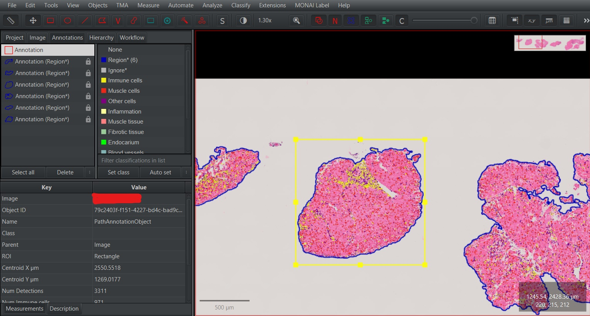
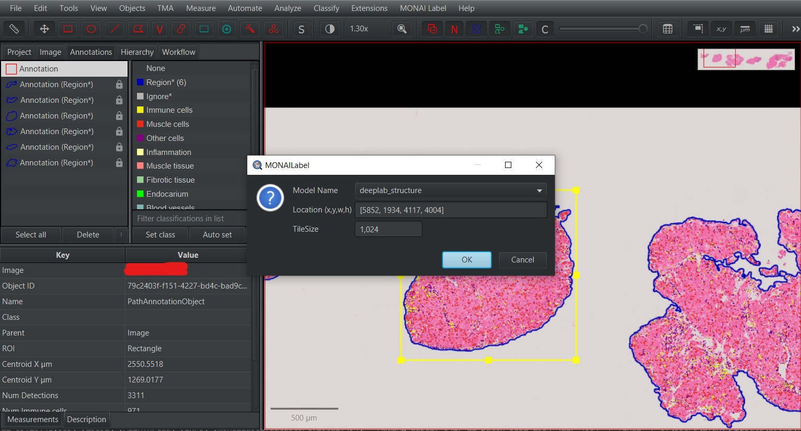
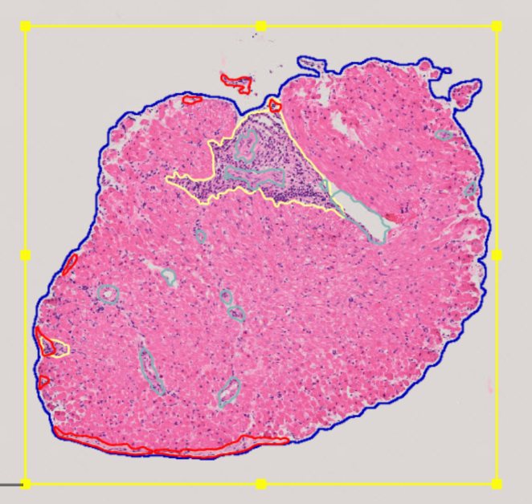
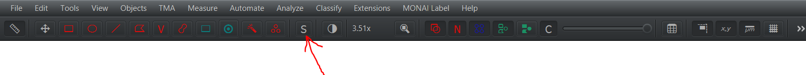

# MONAI Label 

Minimálne požiadavky na hardware:
 - 16GB CPU RAM
 - Grafická karta podporujúca Cuda - [zoznam](https://developer.nvidia.com/cuda-gpus)
 - Grafická karta minimálne s 6GB pamäte


## Inštalácia

Všetky nižšie uvedené kroky sú potrebné pre zabezpečenie správneho fungovania QuPath spolu s rozšírením MONAI Label.

Jednotlivé kroky inštalácie pozostávajú z inštalácie QuPath a inštalácie MONAI Label.

### QuPath

1. Stiahnite [QuPath](https://qupath.github.io/) z oficiálnej stránky.
2. Po stiahnutí inštalátora, spustite samotnú inštaláciu nástroj QuPath a postupujte podľa jednotlivých krokov.

### MONAI Label

Pre nainštalovanie MONAI Label spolu s pridanými modelmi pre segmentáciu vyšších morfologických štruktúr postupujte nasledovne:
1. Z [repozitára](https://github.com/ivanvykopal/MONAILabel/tree/development) stiahnuť vetvu development.
  - Prvý spôsob cez `Code` > `Download ZIP`
  - Druhý spôsob:
    ```git
    git clone https://github.com/ivanvykopal/MONAILabel.git
    git fetch --all
    git checkout development
    ```
2. Stiahnuť váhy pre pridané modely z `Weights` z [Google Drive](https://drive.google.com/drive/folders/17Co6XpxxykH2mJprgUmO1OHsrqj-Ybhh?usp=sharing). Je potrebné schválenie administrátorom.
3. Stiahnuť detektory a scripty zo `Scripts` z [Google Drive](https://drive.google.com/drive/folders/17Co6XpxxykH2mJprgUmO1OHsrqj-Ybhh?usp=sharing) pre identifikáciu tkaniva a buniek v rámci WSI snímku spolu aj s výslednou klasifikáciou buniek. Je potrebné schválenie administrátorom.
4. V rámci stiahnutých zdrojových kódov vytvorte prostredie pre python:
   - S využitím príkazu `venv`
      ```bash
      virtualenv ".venv/monailabel" -p python3.9.16
      ```
    - S využitím `conda`
      ```bash
      conda create -n "monailabel" python=3.9.16
      ```
5. Nainštalovať balíčky z `requirements.txt`
    - `venv`
      ```bash
      .venv/monailabel/Scripts/activate
      python -m pip install --upgrade pip
      pip install -r requirements.txt
      ```
    - `conda`
      ```bash
      conda activate monailabel
      python -m pip install --upgrade pip
      pip install -r requirements.txt
      ```
6. Stiahnuť a nainštalovať [Cuda Toolkit 11.2](https://developer.nvidia.com/cuda-11.2.0-download-archive). Postupujte podľa krokov inštalácie. 
7. Po nainštalovaní Cuda Toolkit je potrebné reštartovať počítač pre správnu konfiguráciu a nastavenie Cuda.
8. Stiahnuť [openslide binaries](https://openslide.org/download/) a Extrahovať ich na ľubovolnom mieste. Po extrakcii je potrebné pridať cetu k `bin` adresáru do premenných prostredia v `PATH`.
9. Pridať do premenných prostedia do `PATH` cestu k `monailabel\scripts` nachádzajúcich sa v tomto adresári. V prípade, ak chýba jú nejaké `dll` knižnice je ich možné stiahnuť z [dll-files.com](https://www.dll-files.com/) a konkrétne ak by išlo o chýbajúce `cudnn64_8.dll`, tak je ho možné stiahnuť pomocou tohto [odkazu](https://www.dll-files.com/cudnn64_8.dll.html). Stiahnuté `dll` súbory je potrebné skopírovať na systémový disk štandarde na windows systémoch je to `C:\Windows\System32`.
10. Stiahnuť najnovšie MONAI Label rozšírenie pre QuPath z [repozitára](https://github.com/ivanvykopal/MONAILabel/tags). Najnovšie rozšírenie sa nachádza v poslednom `Release` ako `qupath-extension-monailabel-{version}.jar`, pričom `version` predstavuje identifikátor poslednej verzie, príklad verzie `0.3.1.5`.
10. Pre pridanie MONAI Label rozšírenia je potrebné spustiť QuPath a stiahnutý súbor `qupath-extension-monailabel-{version}.jar` potiahnuť do oblasti QuPath a odsúhlasiť dialogove okno. Týmto sa do QuPath nainštaluje rozšírenie pre MONAI Label.
11. Stiahnuté váhy pre `pathology_structure_segmentation_nestedunet` pridajte do `apps/pathology/model/pathology_structure_segmentation_nestedunet/models` a váhy pre `pathology_structure_segmentation_deeplabv3plus` pridajte do `apps/pathology/model/pathology_structure_segmentation_deeplabv3plus/models`.
12. Po spustení QuPath v časti `Edit` > `Preferences...` > `MONAI Label` zmente Server URL na `http://0.0.0.0:8000`.

## Spustenie servera

Pred spustením servera je potrebné spustiť Python prostredie:
 - `venv`
 ```bash
 .venv/monailabel/Scripts/activate
 ```
 - `conda`
 ```bash
 conda activate monailabel
 ```

 Následne by sme mali vedieť spustiť Server pre MONAI Label:

```bash
monailabel start_server --app apps/pathology --studies datasets/
```

## Segmentácia v QuPath

1. Vytvorte QuPath projekt a do vytvoreného projektu nahrajte snímky, ktoré chcete analyzovať. Vo vytvorenom projekte nahraďte adresár `classifiers` adresárom `classifiers` stiahnutým z [Google Drive](https://drive.google.com/drive/folders/1bhz1DO326o8tb0fFrWJbUx2rqfqWRAYy).

2. Prekopírujte adresár `scripts` z [Google Drive](https://drive.google.com/drive/folders/1bhz1DO326o8tb0fFrWJbUx2rqfqWRAYy) do vytvoreného QuPath projektu do rovnakého adresára, v ktorom sa nachádza adresár `classifiers`.

3. Vytvorte anotácie pre tkanivo a bunky spolu s ich klasifikáciami. Pre tento krok je možné využiť stiahnutý script alebo napísať vlastný.

    Pre využitie stiahnutého scriptu `Tissue detection and cell detection.groovy` otvorte v paneli `Automate` > `Show script editor`. Po otvorení Script editora zvoľte `File` > `Open...` vyberte adresár, v ktorom sa nachádzajú stiahnuté scripty a vyberte script `Tissue detection and cell detection.groovy`. Po načítaní scriptu zvoľte možnosť `Run`, čím prebehne segmentácia tkaniva a buniek a klasifikácia buniek.


2. Vyznačenie časti snímku, pre ktorý sa má vykonať predikcia.



3. Zvoľte možnosť `MONAI Label` > `Annotations...` a následne vyberte model, ktorým chcete vykonať predikciu v časti `Model Name`.

    Aktuálne dostupné modely sú:
      - `deeplab_structure` - DeepLabV3+ pre predikciu ciev, zápalu a endokardu v H&E snímkoch
      - `nestedunet_structure` - U-Net++ pre predikciu ciev, zápalu a endokardu v H&E snímkoch
      - TODO: `unet_srel` - U-Net pre predikciu endokardu v SRel snímkoch

    Po výbere modelu stlačte `OK`.



4. Po dokončení predikcie sú výsledky dostupné v QuPath, kde ich je možné upravovať, mazať poprípade doplniť chýbajúce anotácie manuálne.




Pre výber anotácií, ktoré chceme vymazať je potrebné spustiť `Selection mode`, ktorý zvolíme možnosťou `S` nachádzajúcim sa v paneli. Po zapnutí `Selection mode` je možné využiť rôzne spôsoby výberu, či už s využitím obdĺžnika alebo pomocou štetca (brush). Pre zrušenie `Selection mode` kliknite opätovne možnosť `S`.


